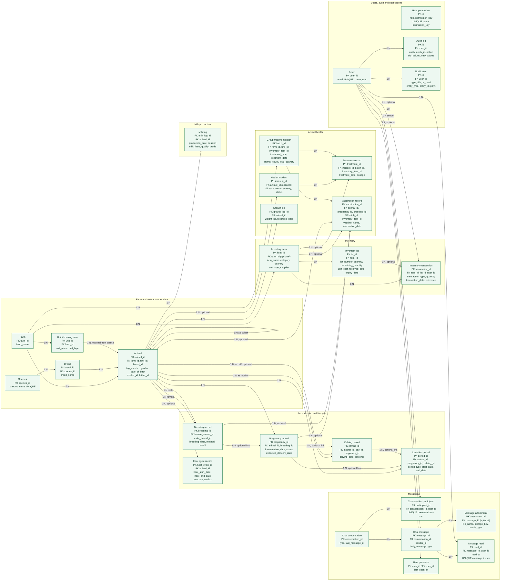
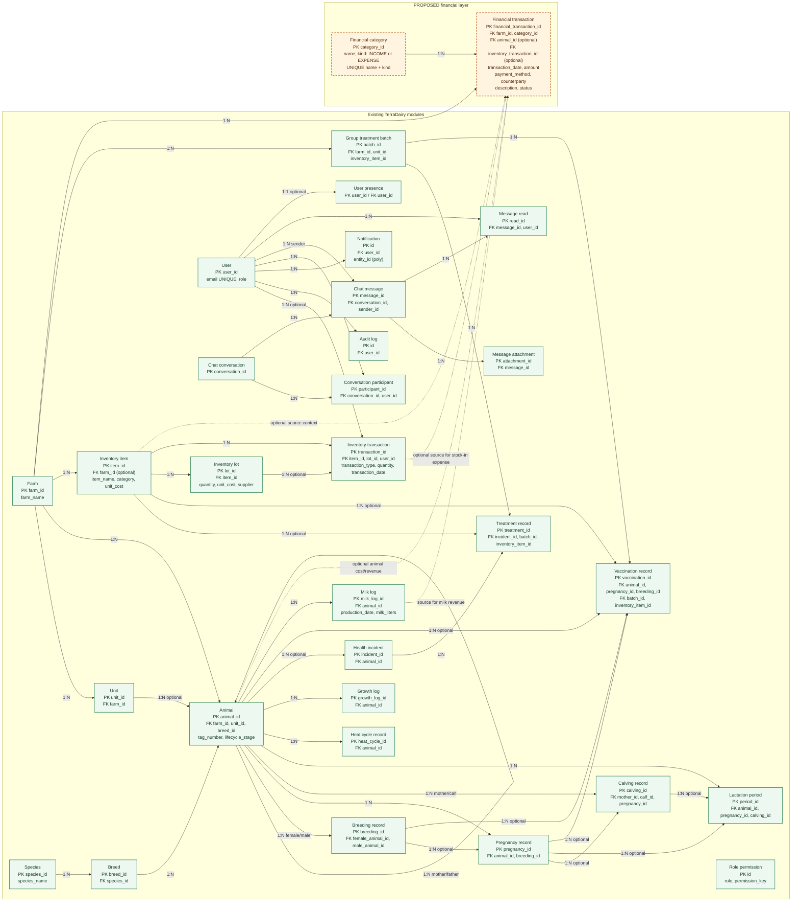

# TerraDairy Database Diagrams

This document describes the database that is actually implemented in
`prisma/schema.prisma`, followed by a proposed financial layer. The diagrams
show the important fields only; they are not a replacement for the Prisma
schema.

## Legend

- **PK**: primary key
- **FK**: foreign key
- **1:N**: one-to-many
- **1:1**: one-to-one
- Solid green nodes: existing implemented models
- Dashed orange nodes: proposed financial models
- A relationship labelled `optional` has a nullable foreign key
- `poly` means the existing model stores a type and id pair without a database FK

## Diagram 1: TerraDairy — Existing Database Schema

### Reading the existing schema

- A farm owns units, animals, inventory items, and group treatment batches.
- An animal belongs to one farm and one breed, may be assigned to a unit, and
  can point to another animal as its mother or father. The `(farm_id,
  tag_number)` pair is unique.
- Milk, growth, health, heat, pregnancy, lactation, breeding, calving, and
  vaccination records are connected through animal and workflow foreign keys.
- Treatments and vaccinations can reference inventory items and group treatment
  batches. The schema therefore already records operational consumption context,
  but it does not record a monetary ledger.
- Inventory is represented by items, optional lots, and stock movements. A
  stock-in movement can carry a reference, supplier, and unit cost through the
  related item/lot data.
- Users connect to audit logs, notifications, inventory movements, and chat.
  `role_permissions` currently has no FK to `users` or another model.

## Diagram 2: TerraDairy — Proposed Integrated Database Schema

The green nodes and relationships below are existing. Orange dashed nodes are
the suggested additions only. The proposed design intentionally reuses
inventory and production records instead of copying them into accounting
tables.

## Proposed financial entities

### `financial_categories`

Reusable farm-independent labels such as `Milk sales`, `Animal sales`, `Feed`,
`Medicines`, `Vaccinations`, `Veterinary`, `Labor`, `Utilities`, `Equipment`,
`Maintenance`, and `Other`. The `kind` field separates income from expenses.
Keeping categories in a table makes category-based reports stable while still
allowing administrators to add categories later.

### `financial_transactions`

The accounting event table. Recommended important fields are:

- `financial_transaction_id` (PK)
- `farm_id` (required FK to the existing `farms` table)
- `category_id` (required FK to `financial_categories`)
- `animal_id` (nullable FK to `animals`)
- `inventory_transaction_id` (nullable FK to `inventory_transactions`)
- `transaction_date`, `amount`, and `description`
- `payment_method` and `counterparty` as controlled values or snapshots
- `status` such as `DRAFT`, `POSTED`, or `VOID`

One row can represent a milk sale, animal sale, farm utility bill, labor cost,
or any other income/expense. A farm-level expense leaves `animal_id` null. An
animal purchase, treatment bill, feed allocation, or animal sale can set it.

## How the integration works

1. **Milk revenue:** create a financial income transaction in the `Milk sales`
   category and retain the relevant date and description. The existing `milk_logs`
   remain production records; they are not copied into the ledger. If sales are
   recorded in batches, the transaction can carry a reference to the reporting
   period or an external receipt.
2. **Animal revenue and costs:** link the transaction to `animal_id` for animal
   purchase cost, medical cost, feed allocation, or sale revenue. This enables
   animal profitability as income minus linked expenses.
3. **Inventory purchases:** for a stock-in purchase, link the financial row to
   the existing `inventory_transaction_id`. The amount can be captured at
   posting time from the lot/item quantity and unit cost, while the inventory
   movement remains the stock ledger. This avoids a second purchase table.
4. **Shared treatment:** a group treatment or farm operating cost can remain
   farm-level with `animal_id` null. If later the business wants per-animal
   allocation, create child financial rows or an allocation mechanism rather
   than pretending the group batch belongs to one animal.
5. **Reports:** filter `financial_transactions` by `farm_id`, date range, kind,
   and category. Profit is posted income minus posted expenses; cash flow can
   additionally filter by payment status and payment date if those fields are
   added in the implementation phase.

## Assumptions and current gaps

- The checkout contains `prisma/schema.prisma` but no `prisma/migrations`
  directory. The diagrams therefore treat the Prisma schema as the current
  database source of truth.
- There is no implemented farm-user membership FK. Users are not shown as farm
  owners or farm members in the diagrams; adding that would be a separate access
  model decision.
- `inventory_items.supplier` and stock/lot supplier values are free text. The
  proposal keeps `counterparty` as a transaction snapshot instead of inventing a
  supplier/customer table. A later procurement module could add one and migrate
  these values.
- `health_incidents.veterinarian_id` is an integer without a Prisma relation, so
  it is not drawn as a user FK.
- `breeding_records.semen_batch_id` is a free-form string. It is not drawn as a
  relation to inventory because the schema explicitly documents that semen
  inventory is not implemented.
- `notifications.entity_type` and `entity_id` are a polymorphic reference, not
  a database-enforced FK; the diagram marks this as `poly`.
- The current inventory model stores `unit_cost`, but a stock-out does not itself
  identify a monetary expense or an animal allocation. Financial posting rules
  will need to define whether expenses are recognized at purchase, consumption,
  or both, and must avoid counting the same cost twice.
- Payment method, customer identity, invoice numbers, payment date, currency,
  and tax are not currently present. They should be added only when the financial
  workflow requirements are settled.

No Prisma schema, migration, application code, or database data is changed by
this document.